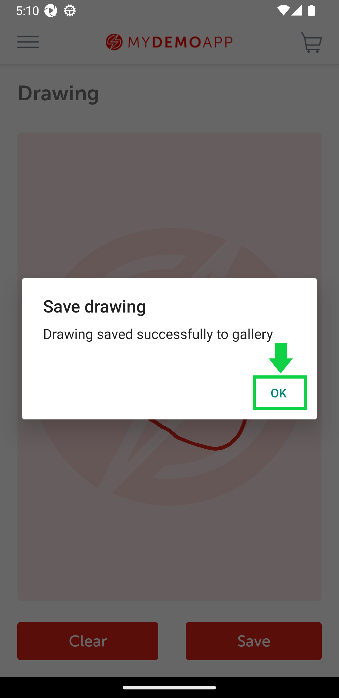

# Test Automation Framework for Android App
### Using:
- Appium
- Selenium
- Java 8
- Cucumber to BDD
- TestNG

## Test Cases
1. View Catalog
````
Feature: Add catalog element to card

  As a user
  I want to be able to add elements of a catalog to a card
  So that I can keep track of the items I am interested in
  @SmokeTest
  Scenario Outline: Add an element to a card
    When The user selects an element
    And Clicks on the Add to card button
    Then The element should be added to the user's card
    And The user clicks Proceed To Checkout button
    When The user input an username "bob@example.com"
    And The user input an password "10203040"
    When The user click the login button
    Then The user types Full Name "Diego Flores"
    And The user types Address one "Valle Lejos 1212"
    And The user types Address two "Villa Far Far away 2"
    And The user types City "Tijuana"
    And The user types State "Baja California"
    And The user types Zip Code "12345"
    And The user types Country "Mexico"
    Then The user clicks To Payment
    When The user types Full Name "<fullName>"
    And The user types Card Number "<cardNumber>"
    And The user types Expiration Date "<ExpDate>"
    And The user types Security Code "<SecurityCode>"
    Then The user clicks Review Order button
    And The user clicks Place Order button
    Then The user sees Checkout Complete

    Examples:
      | fullName          | cardNumber      | ExpDate | SecurityCode |
      | Diego Flores      | 111111111111111| 0325    |  111         |
````

|                     Catalog View                      |                     Product View                      | Cart View                                             | To Payment                                            | Review Order                                          | Place Order                                           | Check Complete                                        |
|:-----------------------------------------------------:|:-----------------------------------------------------:|:------------------------------------------------------|:------------------------------------------------------|:------------------------------------------------------|:------------------------------------------------------|:------------------------------------------------------|
|  |  |  |  |  |  |  |

2. View WebView
````
Feature: Navigate to a website in a WebView
    As a user
    I want to be able to navigate to a website in a WebView
    So that I can use the website's functionality within my app
@SmokeTestWebView
    Scenario: Navigate to a website in a WebView
        Given The user is on the home screen
        When The user clicks on the burger button
        And Clicks on the WebView option
        And Inserts the URL "https://www.google.com.mx" into the input field
        And Clicks on the Go to site button
        Then The website should be displayed in the WebView
        And The user inserts "hello world" in the google page
        And Clicks on the search button
        Then The search results should be displayed
````
|                        WebView                        | Google Search                                         |
|:-----------------------------------------------------:|:------------------------------------------------------|
|  |  |

3. View Geo Location
````
Feature: Geolocation functionality
    As a user
    I want to be able to access and use the geolocation feature of the device
    So that I can see my current location
@SmokeGeoLocation
    Scenario: Access and use geolocation feature
        Given The user opens the geolocation page
        Then The latitude and longitude should be different from "0"
        When The user clicks on the Stop Observing button
        And The user clicks on the Start Observing button
        Then The geolocation should be updated and displayed on the page
````
|                     Geo Location View                     |
|:---------------------------------------------------------:|
|  |

4. View Drawing
````
Feature: Drawing functionality
    As a user
    I want to be able to draw on a canvas
    So that I can save and clear my drawings
@SmokeDrawing
    Scenario: Draw and save a circle on canvas
        Given The user is on the drawing page
        When The user opens the drawing page
        And The user draws a circle on the canvas
        And The user clicks on the Save button
        Then The drawing should be saved
        And When the user clicks on the Clear button
        Then The canvas should be cleared
````

|                     Drawing View                      |                   Drawing a sketch                    |                Save Pop Up to verifier                |
|:-----------------------------------------------------:|:-----------------------------------------------------:|:-----------------------------------------------------:|
|  |  |  |

5. Login Page
````
@SmokeLogin
Feature: Login
  As a user
  I want to be able to log in to the application
  So that I can access the catalog page
Background:
  Given The user is on the login page

  Scenario: Successful login with correct credential
    When The user input an username "bob@example.com"
    And The user input an password "10203040"
    When The user click the login button
    Then The user should be directed to the catalog page

  Scenario Outline: Unsuccessful login with incorrect credentials
    When The user input an username "<username>"
    And The user input an password "<password>"
    When The user click the login button
    Then I should see an error message "<errorMessage>"
    Examples:
      | username          | password | errorMessage |
      | alice@example.com | 10203040 |      Sorry, this user has been locked out.        |
      | bob@example.com   | 10203041 |        Provided credentials do not match any user in this service.      |
````
### Scenario: Successful login with correct credential
|                    Login View                     |              Input username and pwd               |                As a result display                |
|:-------------------------------------------------:|:-------------------------------------------------:|:-------------------------------------------------:|
|  |  |  |

### Scenario Outline: Unsuccessful login with incorrect credentials
|                    Locked out                     |                 Wrong credentials                 |
|:-------------------------------------------------:|:-------------------------------------------------:|
|  |  |

6. LogOut Page
````
@SmokeLogOut
Feature: Logout
  As a user
  the user wants to be able to log out of the application
  So that user can exit his session securely
Background:
  Given The user is in Catalog
  When The user open the left menu of options
  And The user clicks the logout option
  When The user looks at the logout confirmation pop-up "Log Out"
  Scenario: Successful logout
    And The user clicks the logout button
    And The user clicks OK on the confirmation pop-up "You are successfully logged out."
    Then The user should be logged out

  Scenario: Cancel logout
    And The user clicks the cancel button
    Then The user returns to left menu
````
|                    Logout option                    |                 Pop up with options                 |               Pop up with success msg               |                 Logout Final Screen                 |
|:---------------------------------------------------:|:---------------------------------------------------:|:---------------------------------------------------:|:---------------------------------------------------:|
|  |  |  |  |

6. ResetApp Page
````
@SmokeResetApp
Feature: Reset App
  As a user
  I want to be able to reset the app
  So that I can start fresh with the application
Background:
  Given The user is in Catalog
  When The user open the left menu of options
  And The user clicks the reset option
  When The user looks at the reset confirmation pop-up "Reset App State"
  Scenario: Successful reset app
    And The user clicks the reset app button
    And The user clicks OK on the confirmation pop-up "App State has been reset."
    Then The user returns to left menu

  Scenario: Cancel reset app
    And The user clicks the cancel button
    Then The user returns to left menu
````
|                   Reset option                    |                Pop up with options                |              Pop up with success msg              |
|:-------------------------------------------------:|:-------------------------------------------------:|:-------------------------------------------------:|
|  |  |  |

7. QR Code Scanner
````
@SmokeQRCodeScanner
Feature: Scan QR Code
  As a user
  I want to be able to scan a QR code
  So that I can open a URL in a browser
  Scenario: Successful scanned QR code
    Given The user is in Qr Code Scanner view
    When The camera is open and look at QR
    Then The user sees browser with url "saucedemo.com"
````
Note: To open QR code in virtual camera is need to follow this page: [Automate_custom_image_using_android_emulator](https://medium.com/@mhabiib/automate-custom-image-using-android-emulator-virtual-scene-camera-817086056fca)

|                 QR Code Scanner View                  |                  Browser opening URL                  |
|:-----------------------------------------------------:|:-----------------------------------------------------:|
|  |  |
